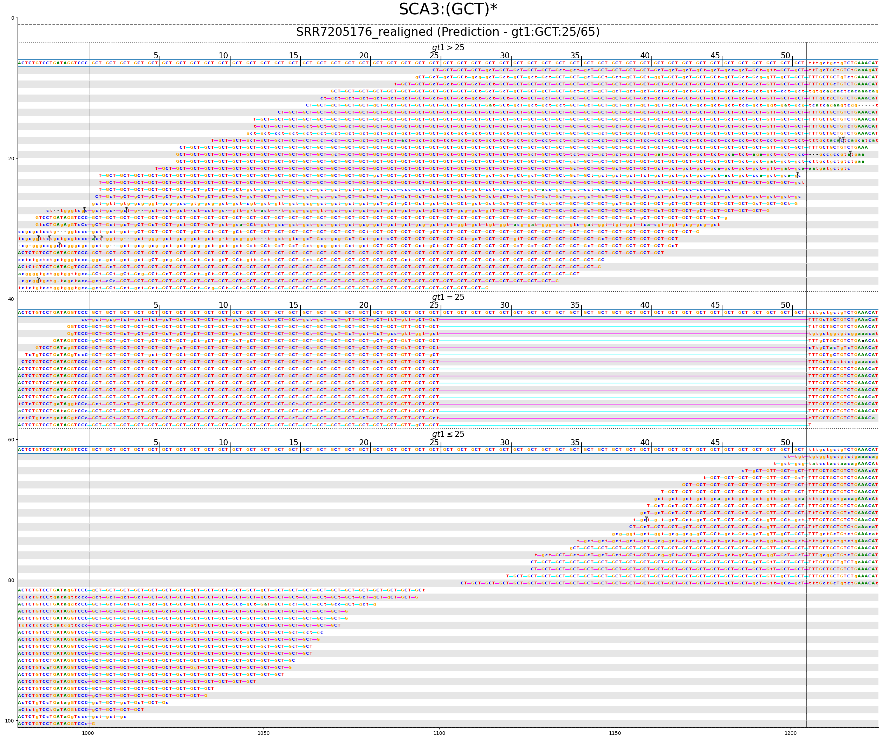

# Targeted search for expansions of STRs known to be associated with disease

The `scripts` directory contains two scripts to visualise results

- [`4a_visualise_str_results.R`](scripts/4a_visualise_str_results.R): an R script to plot ExpansionHunter and exSTRa results
- [`4b_graphalignmentviewer.sh`](scripts/4b_graphalignmentviewer.sh): run GraphAlignmentViewer to generate pileup images of ExpansionHunter alignments


Note: this example workflow assumes that the `STR_Expansions_Example_Workflow` directory is in your home directory.
If it is located elsewhere, you will need to modify two lines, one in [`4a_visualise_str_results.R`](scripts/4a_visualise_str_results.R)

```R
work_dir <- "~/STR_Expansions_Example_Workflow"
```

and one in [`4b_graphalignmentviewer.sh`](scripts/4b_graphalignmentviewer.sh)

```bash
WORK_DIR=~/STR_Expansions_Example_Workflow
```

---

## Plotting ExpansionHunter and exSTRa results

The [`4a_visualise_str_results.R`](scripts/4a_visualise_str_results.R) script loads the output generate by ExpansionHunter and exSTRa and generates a plot for each STR locus that was analysed.

Below is the output for SCA3 (Spinocerebellar ataxia 3).
On the left is a scatter plot displaying the repeat sizes predicted by ExpansionHunter (smaller repeat size on x-axis, larger repeat on y-axis).
Expanded samples exceeding the pathogenic threshold lie above the red dashed line.
On the right is an empirical cummulative distribution function of the number of repeat bases generated by exSTRa.
Expanded samples contain higher repeat content and appear as outliers shifted to the right relative to the distribution of the rest of the cohort.


## Visualising ExpansionHunter alignments with GraphAlignmentViewer

GraphAlignmentViewer is a tool for visualising ExpansionHunter alignments.
It generates images which show the sequencing reads supporting genotypes predicted by ExpansionHunter.

Recently, manual review of these images was shown to reduce (the already very low) false positive rate of repeat expansion predicted by ExpansionHunter.
For further details, see [Ibanez et al. 2020. bioRxiv. _Whole genome sequencing for diagnosis of neurological repeat expansion disorders_]()

GraphAlignmentViewer is a Python 3 script.

It requires the following input to run:

- bam files generated by ExpansionHunter
- database of repeats used by ExpansionHunter

We will also provide some additional (optional) input:

- genotype files generated by ExpansionHunter (vcf / json)
- reference genome
- output prefix and directory

```bash
BAMS=`ls $WORK_DIR/results/ExpansionHunter/*_realigned.bam`

REPEATDB_EH=$WORK_DIR/repeats/ExpansionHunter_known_hg38.json

REFERENCE=$WORK_DIR/minibam/Homo_sapiens_assembly38.fasta

OUTPUT_DIR=$WORK_DIR/results/GraphAlignmentViewer
```

Run GraphAlignmentViewer

```bash
mkdir -p $OUTPUT_DIR

for BAM in $BAMS
do
    BASE=$(basename $BAM "_realigned.bam")
    mkdir -p $OUTPUT_DIR/$BASE
    
    python3 $WORK_DIR/tools/GraphAlignmentViewer/GraphAlignmentViewer.py \
        --read_align $BAM \
        --variant_catalog $REPEATDB_EH \
        --gt_file $WORK_DIR/results/ExpansionHunter/$BASE.vcf \
        --reference_fasta $REFERENCE \
        --output_prefix $BASE \
        --output_dir $OUTPUT_DIR/$BASE
done
```

This generates a pileup displaying the alignments supporting the genotypes predicted by ExpansionHunter.
Below is an example for a sample with a SCA3 expansion, showing one expanded allele (top third) and one normal allele (middle third).
The reads in the bottom third only partially overlap the STR and could originate from either allele.




